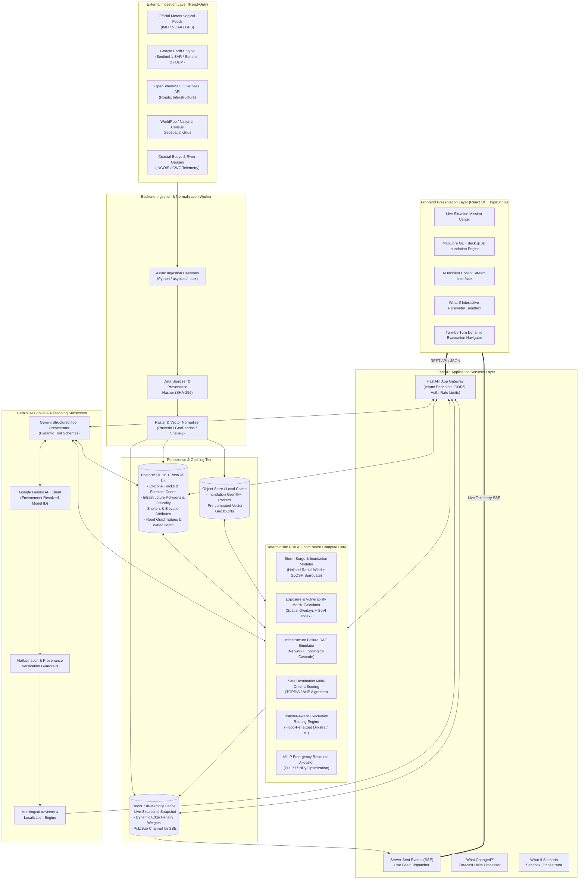
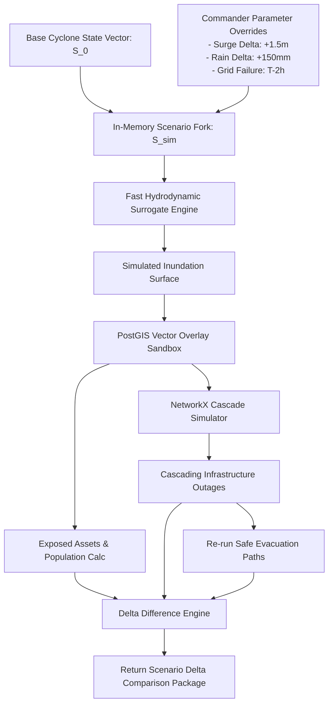
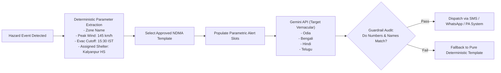
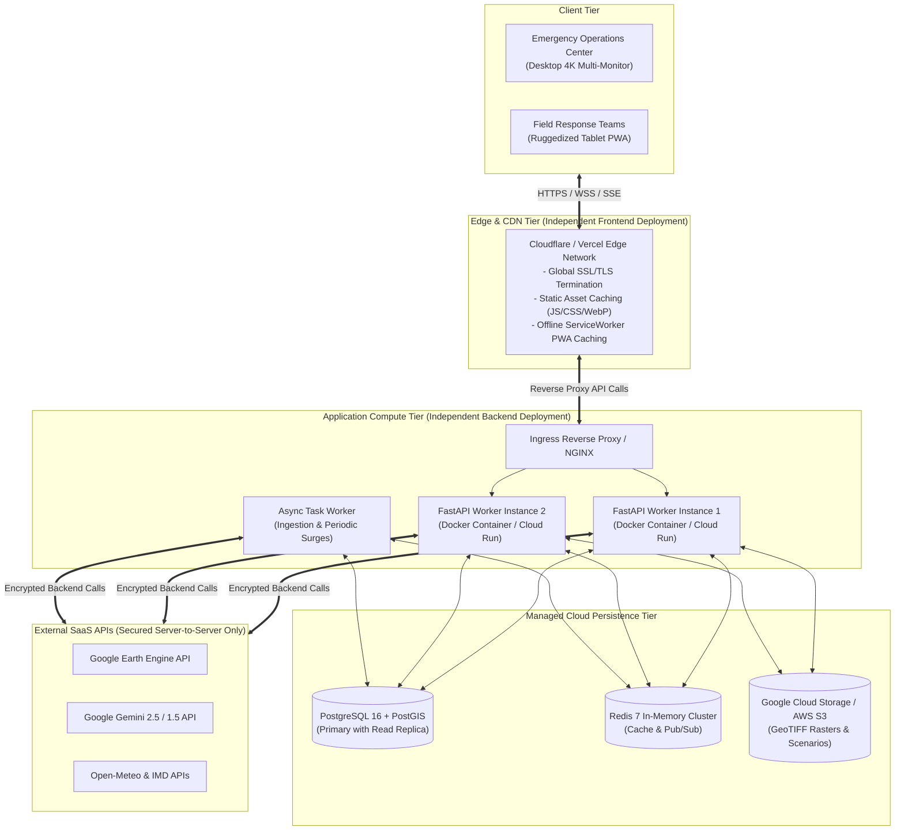

# PRALAYA: System Architecture & Technical Design Document

---

### 1. High-Level System Architecture

PRALAYA is architected on an **Event-Driven, Asynchronous Decoupled Micro-Core Architecture**. It strictly enforces the boundary between deterministic spatial-mathematical computation and probabilistic generative AI reasoning.



---

### 2. Component Boundaries & Responsibilities

| Subsystem | Tech Stack | Responsibilities | Boundary Invariants |
| :--- | :--- | :--- | :--- |
| **Frontend UI** | React 19, TypeScript, MapLibre GL, deck.gl, Tailwind CSS | Visualizes state, renders interactive vector/raster tiles, streams copilot dialogue, collects what-if slider inputs. | **Zero** direct external API calls (never call Gemini or GEE directly). No secrets or tokens stored in browser bundle. |
| **Backend API Gateway** | FastAPI, Pydantic v2, Python 3.11+ | Request routing, authentication, input sanitization, rate limiting, SSE pub/sub handling, response serialization. | Enforces strict Pydantic schemas on all in/out data. Central gatekeeper for all subsystems. |
| **Deterministic Compute Engine** | NumPy, SciPy, NetworkX, GeoPandas, Shapely | Physical hazard calculation, vulnerability scoring, failure cascade propagation, graph routing, shelter ranking. | Pure deterministic code. No stochastic LLM calls within mathematical pipelines. |
| **Spatial Database** | PostgreSQL 16, PostGIS 3.4 | Stores geospatial vectors (roads, shelters, assets, zones, track coordinates), spatial indexing (`GIST`). | Master source of truth for geographical queries and topological relationships. |
| **Geospatial Processing Worker** | Google Earth Engine Python API, Rasterio | Ingests satellite radar (SAR) flood masks, extracts DEM slope/elevation, builds GeoTIFF inundation maps. | Converts planetary raster datasets into lightweight GeoJSON / COG tiles. |
| **Gemini Copilot Agent** | Google GenAI SDK, Pydantic | Provides strategic advice, synthesizes complex multi-hazard situations, translates alerts into local vernaculars. | Must **only** formulate statements based on deterministic tools and validated DB snapshots. |

---

### 3. Geospatial Data Flow & Processing Pipeline

The geospatial pipeline transforms planetary-scale remote sensing rasters and meteorological forecasts into lightweight, actionable vector and raster layers:

```mermaid
sequenceDiagram
    autonumber
    participant SAT as Satellite / Weather (Sentinel-1 / IMD)
    participant WORKER as Geospatial Worker (GEE / Rasterio)
    participant DB as PostGIS / Object Store
    participant HAZARD as Hazard & Cascade Engine
    participant API as FastAPI Gateway
    participant CLIENT as Frontend Map (MapLibre / deck.gl)

    SAT->>WORKER: Ingest Cyclone Vector Track + Sentinel-1 SAR GRD
    WORKER->>WORKER: Pre-process SAR: Radiometric calibration, Lee Speckle filter, Otsu Bimodal Thresholding
    WORKER->>DB: Store Inundation Polygon Mask & Water Depth Raster (COG)
    DB->>HAZARD: Trigger Dynamic Hazard Assessment
    HAZARD->>HAZARD: Calculate intersection: Flood Depth > Asset Critical Threshold
    HAZARD->>HAZARD: Propagate failure DAG (e.g. Substation submerged -> Power Grid Off)
    HAZARD->>DB: Write Asset Status & Road Impassability Flags
    HAZARD->>API: Publish Event Delta to Redis Pub/Sub
    API->>CLIENT: Push SSE Alert: "Bridge B-14 impassable; Hospital H-2 on emergency backup"
    CLIENT->>API: GET /api/v1/routing/evacuation (Origin, Target)
    API->>HAZARD: Request Hazard-Aware Route (Penalized Dijkstra)
    HAZARD-->>API: Return GeoJSON LineString (Zero flood immersion path)
    API-->>CLIENT: Render 3D Evacuation Vector Path on Map
```

#### Earth Engine Processing Details:
1. **Sentinel-1 SAR Flood Inundation**:
   - Ingests Level-1 Ground Range Detected (GRD) Dual-Pol (VV + VH) products in Interferometric Wide (IW) swath mode.
   - Computes backscatter coefficient ($\sigma^0$) in decibels: $\sigma^0_{\text{dB}} = 10 \cdot \log_{10}(\sigma^0)$.
   - Applies Lee Sigma speckle filter ($7 \times 7$ kernel) to suppress speckle noise while preserving hydrological edges.
   - Evaluates Otsu bimodal thresholding on the difference raster ($\Delta \sigma^0 = \sigma^0_{\text{event}} - \sigma^0_{\text{baseline}}$) to delineate open standing floodwater (water shows specular reflection with backscatter values $\le -16\text{ dB}$).
2. **Elevation & Plinth Integration**:
   - Incorporates Copernicus GLO-30 and FABDEM (bare-earth corrected digital elevation model removing vegetation and building height biases).
   - Projects water levels across the coastal digital elevation grid to derive plinth clearance:
     $$M_{\text{clearance}}(x, y) = Z_{\text{FABDEM}}(x, y) - H_{\text{surge}}(x, y)$$

---

### 4. Simulation Architecture: In-Memory What-If Sandbox

The What-If Disaster Simulator enables civil defense leadership to test counterfactual scenarios (e.g., "What if landfall occurs at high tide with $+1.5\text{ m}$ surge and $150\text{ mm}$ additional rainfall?").



- **State Isolation**: What-If simulations are computed in isolated Python memory spaces using lightweight NumPy array slices and NetworkX graph clones. Production database records are never modified during simulation runs.
- **Computation Time**: The surrogate hydrodynamic model converges within $\le 450\text{ ms}$, ensuring real-time UI interactivity as users drag sliders.

---

### 5. Safe Destination Scoring Architecture (MCDA / TOPSIS)

The Safe Destination Engine deterministically ranks certified cyclone shelters and public staging structures using the **Technique for Order Preference by Similarity to Ideal Solution (TOPSIS)**.

```mermaid
flowchart LR
    CANDIDATES[All Regional Shelters\nPostGIS Query] --> GEO_FILTER[Spatial Bounding Filter\nRadius <= 25km]
    GEO_FILTER --> FLOOD_CHECK[Flood Clearance Check\nZ_plinth - H_water > 0.5m]
    
    FLOOD_CHECK --> CRITERIA_MATRIX[Build Decision Matrix X\n- Clearance Margin\n- Free Capacity Ratio\n- Access Road Safety\n- Medical Generator Status]
    
    CRITERIA_MATRIX --> NORM[Vector Normalization]
    NORM --> WEIGHTS[Apply Weight Vector W]
    WEIGHTS --> IDEAL[Identify Positive & Negative Ideal Solutions]
    IDEAL --> DIST[Calculate Euclidean Distances d+, d-]
    DIST --> TOPSIS_SCORE[Compute Relative Closeness C_i]
    TOPSIS_SCORE --> RANKED_LIST[Ranked Safe Destinations JSON]
```



---

### 6. Disaster-Aware Evacuation Routing Architecture

Standard routing engines (OSRM, Google Maps) direct evacuees along major highways without awareness of developing flood levels, low-clearance underpasses, or downed high-voltage power lines. PRALAYA implements a **Hazard-Penalized Dynamic Cost Routing Engine**:

```mermaid
flowchart TD
    START_REQ[Evacuation Request:\nOrigin & Destination / Auto-Shelter] --> GRAPH[OpenStreetMap Road Graph\nNetworkX In-Memory Cache]
    HAZARD_GRID[Real-Time Flood Depth Surface\nD_flood x, y] --> EDGE_PENALTY[Dynamic Edge Cost Evaluator]
    
    EDGE_PENALTY --> FORMULA["Cost(e) = Length(e) * (1 + alpha * exp(beta * D_flood))"]
    FORMULA --> HARD_CUTOFF{"Flood Depth > 0.30m (Vehicle Stall)?"}
    
    HARD_CUTOFF -- Yes --> SEVER[Edge Weight = INFINITY (Sever Edge)]
    HARD_CUTOFF -- No --> ASSIGN[Assign Weighted Dynamic Cost]
    
    SEVER & ASSIGN --> ALGO["Run Bidirectional A* Search\nwith Elevation Heuristic"]
    ALGO --> PATH[Optimal Safe Evacuation Path]
    PATH --> VALIDATE{Is Path Found?}
    
    VALIDATE -- Yes --> GEOJSON[Export LineString + Elevation Profile + Time Window]
    VALIDATE -- No --> ESCALATE[Flag NO_SAFE_GROUND_ROUTE\nTrigger Amphibious Rescue Dispatch Alert]
```

---

### 7. Multilingual Alert Architecture

The Multilingual Alert Engine adheres to a **Template-Grounded Synthesis Pipeline** to eliminate panic-inducing hallucinations while preserving hyper-local linguistic naturalness:



---

### 8. Deployment Architecture & Independent Service Boundaries

PRALAYA is designed for zero-coupling independent deployments of the presentation tier, API application tier, and persistent spatial storage tier:



- **Zero Client Secrets**: Frontend builds contain no API keys. The browser communicates solely with the FastAPI backend through secure `HttpOnly` cookie-backed sessions or Bearer tokens.
- **Scalability**: Backend FastAPI containers are stateless, enabling horizontal auto-scaling from 1 to 50 instances during sudden cyclone landfall surges.
