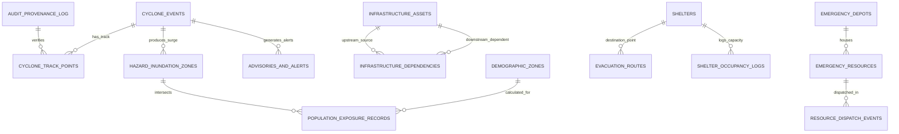

# PRALAYA: Spatial Database Schema & DDL Specification

---

### 1. Database Architecture & Technology Foundation

- **RDBMS Engine**: PostgreSQL 16
- **Spatial Extension**: PostGIS 3.4
- **Spatial Reference Systems (SRS)**:
  - `EPSG:4326` (WGS 84): Standard storage coordinate system for all latitude/longitude geometries.
  - `EPSG:3857` (Web Mercator): Used in spatial queries for meter-based distance calculations and buffering.
- **ORM / Migration**: SQLAlchemy 2.0 (asyncio) + GeoAlchemy2 + Alembic.

---

### 2. Entity-Relationship Model



---

### 3. PostgreSQL / PostGIS Data Definition Language (DDL)

```sql
-- Enable PostGIS Extensions
CREATE EXTENSION IF NOT EXISTS postgis;
CREATE EXTENSION IF NOT EXISTS postgis_topology;
CREATE EXTENSION IF NOT EXISTS btree_gist;
CREATE EXTENSION IF NOT EXISTS "uuid-ossp";

-- 1. Cyclone Events Table
CREATE TABLE cyclone_events (
    id VARCHAR(64) PRIMARY KEY,
    name VARCHAR(100) NOT NULL,
    basin VARCHAR(50) DEFAULT 'NORTH_INDIAN_OCEAN',
    category VARCHAR(50) NOT NULL, -- 'ESCS', 'VSCS', 'SCS', 'CS', 'DD'
    is_active BOOLEAN DEFAULT TRUE,
    landfall_eta TIMESTAMPTZ,
    landfall_location_name VARCHAR(150),
    landfall_geom GEOMETRY(Point, 4326),
    created_at TIMESTAMPTZ DEFAULT NOW(),
    updated_at TIMESTAMPTZ DEFAULT NOW()
);

-- 2. Cyclone Track Points & Forecast Cones
CREATE TABLE cyclone_track_points (
    id UUID PRIMARY KEY DEFAULT uuid_generate_v4(),
    event_id VARCHAR(64) REFERENCES cyclone_events(id) ON DELETE CASCADE,
    time_offset_hours INT NOT NULL, -- e.g. -48, -24, 0, +6, +12
    valid_time TIMESTAMPTZ NOT NULL,
    is_forecast BOOLEAN DEFAULT FALSE,
    eye_geom GEOMETRY(Point, 4326) NOT NULL,
    central_pressure_hpa NUMERIC(6, 2) NOT NULL,
    max_sustained_wind_kmh NUMERIC(5, 2) NOT NULL,
    gust_kmh NUMERIC(5, 2) NOT NULL,
    radius_max_wind_km NUMERIC(5, 2) NOT NULL,
    bearing_degrees NUMERIC(5, 2),
    forward_speed_kmh NUMERIC(5, 2),
    uncertainty_cone_geom GEOMETRY(Polygon, 4326),
    provenance_hash VARCHAR(64) NOT NULL,
    created_at TIMESTAMPTZ DEFAULT NOW()
);
CREATE INDEX idx_track_event_time ON cyclone_track_points(event_id, valid_time);
CREATE INDEX idx_track_eye_geom ON cyclone_track_points USING GIST(eye_geom);
CREATE INDEX idx_track_cone_geom ON cyclone_track_points USING GIST(uncertainty_cone_geom);

-- 3. Hazard Inundation Zones (Flood Footprints)
CREATE TABLE hazard_inundation_zones (
    id UUID PRIMARY KEY DEFAULT uuid_generate_v4(),
    event_id VARCHAR(64) REFERENCES cyclone_events(id) ON DELETE CASCADE,
    forecast_hour INT NOT NULL,
    depth_tier VARCHAR(30) NOT NULL, -- 'LOW_0_0.5M', 'MED_0.5_1.5M', 'HIGH_1.5_3M', 'EXTREME_GT_3M'
    min_depth_m NUMERIC(4, 2) NOT NULL,
    max_depth_m NUMERIC(4, 2) NOT NULL,
    mean_flow_velocity_mps NUMERIC(4, 2) DEFAULT 0.0,
    surge_geom GEOMETRY(MultiPolygon, 4326) NOT NULL,
    raster_cog_uri VARCHAR(255),
    computed_at TIMESTAMPTZ DEFAULT NOW()
);
CREATE INDEX idx_hazard_surge_geom ON hazard_inundation_zones USING GIST(surge_geom);
CREATE INDEX idx_hazard_event_hour ON hazard_inundation_zones(event_id, forecast_hour);

-- 4. Critical Infrastructure Assets
CREATE TABLE infrastructure_assets (
    id VARCHAR(64) PRIMARY KEY,
    name VARCHAR(150) NOT NULL,
    asset_type VARCHAR(50) NOT NULL, -- 'HOSPITAL', 'POWER_SUBSTATION', 'CELL_TOWER', 'WATER_PLANT', 'BRIDGE'
    criticality_level INT CHECK (criticality_level BETWEEN 1 AND 4), -- 4: Highest (ICU / Substation)
    location_geom GEOMETRY(Point, 4326) NOT NULL,
    footprint_geom GEOMETRY(Polygon, 4326),
    plinth_elevation_m NUMERIC(5, 2) NOT NULL,
    flood_failure_threshold_m NUMERIC(4, 2) DEFAULT 0.30, -- Inundation depth causing operational shutdown
    operational_status VARCHAR(30) DEFAULT 'OPERATIONAL', -- 'OPERATIONAL', 'DEGRADED', 'OFFLINE', 'EVACUATING'
    backup_generator_present BOOLEAN DEFAULT FALSE,
    generator_runtime_hours NUMERIC(5, 2) DEFAULT 0.0,
    metadata JSONB DEFAULT '{}'::jsonb,
    updated_at TIMESTAMPTZ DEFAULT NOW()
);
CREATE INDEX idx_infra_location_geom ON infrastructure_assets USING GIST(location_geom);
CREATE INDEX idx_infra_type_status ON infrastructure_assets(asset_type, operational_status);

-- 5. Infrastructure Dependency Directed Graph (DAG Edges)
CREATE TABLE infrastructure_dependencies (
    id UUID PRIMARY KEY DEFAULT uuid_generate_v4(),
    upstream_asset_id VARCHAR(64) REFERENCES infrastructure_assets(id) ON DELETE CASCADE,
    downstream_asset_id VARCHAR(64) REFERENCES infrastructure_assets(id) ON DELETE CASCADE,
    dependency_type VARCHAR(50) NOT NULL, -- 'POWER_SUPPLY', 'COOLING_WATER', 'TELECOM_TELEMETRY', 'ACCESS_ROAD'
    cascade_delay_hours NUMERIC(4, 2) DEFAULT 0.0, -- Grace period before downstream fails (e.g. UPS/battery runtime)
    is_critical BOOLEAN DEFAULT TRUE,
    CONSTRAINT chk_no_self_dependency CHECK (upstream_asset_id <> downstream_asset_id)
);
CREATE INDEX idx_dep_upstream ON infrastructure_dependencies(upstream_asset_id);
CREATE INDEX idx_dep_downstream ON infrastructure_dependencies(downstream_asset_id);

-- 6. Cyclone Shelters & Public Safe Destinations
CREATE TABLE shelters (
    id VARCHAR(64) PRIMARY KEY,
    name VARCHAR(150) NOT NULL,
    shelter_type VARCHAR(50) NOT NULL, -- 'CYCLONE_SHELTER', 'SCHOOL', 'COMMUNITY_CENTER', 'COLLEGE'
    location_geom GEOMETRY(Point, 4326) NOT NULL,
    certified_capacity INT NOT NULL CHECK (certified_capacity > 0),
    current_occupancy INT DEFAULT 0 CHECK (current_occupancy >= 0),
    plinth_elevation_m NUMERIC(5, 2) NOT NULL,
    has_backup_power BOOLEAN DEFAULT TRUE,
    has_potable_water BOOLEAN DEFAULT TRUE,
    medical_post_active BOOLEAN DEFAULT FALSE,
    is_accessible BOOLEAN DEFAULT TRUE,
    contact_phone VARCHAR(30),
    last_verified_at TIMESTAMPTZ DEFAULT NOW()
);
CREATE INDEX idx_shelters_geom ON shelters USING GIST(location_geom);
CREATE INDEX idx_shelters_capacity ON shelters(certified_capacity, current_occupancy);

-- 7. Demographic Units & Social Vulnerability Index (SoVI)
CREATE TABLE demographic_zones (
    id VARCHAR(64) PRIMARY KEY,
    name VARCHAR(100) NOT NULL,
    admin_level VARCHAR(30) DEFAULT 'MANDAL', -- 'DISTRICT', 'MANDAL', 'WARD', 'VILLAGE'
    boundary_geom GEOMETRY(MultiPolygon, 4326) NOT NULL,
    total_population INT NOT NULL,
    infants_count INT DEFAULT 0,
    elderly_count INT DEFAULT 0,
    disabled_count INT DEFAULT 0,
    kutcha_housing_pct NUMERIC(5, 2) NOT NULL,
    semi_pucca_pct NUMERIC(5, 2) NOT NULL,
    pucca_pct NUMERIC(5, 2) NOT NULL,
    composite_vulnerability_index NUMERIC(4, 3) CHECK (composite_vulnerability_index BETWEEN 0.0 AND 1.0),
    created_at TIMESTAMPTZ DEFAULT NOW()
);
CREATE INDEX idx_demographic_boundary ON demographic_zones USING GIST(boundary_geom);

-- 8. Disaster-Aware Evacuation Routes
CREATE TABLE evacuation_routes (
    id VARCHAR(64) PRIMARY KEY,
    origin_zone_id VARCHAR(64) REFERENCES demographic_zones(id),
    destination_shelter_id VARCHAR(64) REFERENCES shelters(id),
    route_geom GEOMETRY(LineString, 4326) NOT NULL,
    total_distance_km NUMERIC(6, 2) NOT NULL,
    est_transit_minutes NUMERIC(6, 2) NOT NULL,
    max_flood_depth_m NUMERIC(4, 2) DEFAULT 0.0,
    safety_clearance_window_hours NUMERIC(4, 2),
    elevation_profile JSONB DEFAULT '[]'::jsonb,
    is_currently_viable BOOLEAN DEFAULT TRUE,
    computed_at TIMESTAMPTZ DEFAULT NOW()
);
CREATE INDEX idx_routes_geom ON evacuation_routes USING GIST(route_geom);

-- 9. Emergency Resources & NDRF/SDRF Allocations
CREATE TABLE emergency_resources (
    id VARCHAR(64) PRIMARY KEY,
    resource_type VARCHAR(50) NOT NULL, -- 'RESCUE_BOAT', 'NDRF_TEAM', 'MOBILE_GENERATOR', 'WATER_TANKER'
    quantity_available INT NOT NULL DEFAULT 0,
    current_assigned_zone_id VARCHAR(64) REFERENCES demographic_zones(id),
    status VARCHAR(30) DEFAULT 'READY', -- 'READY', 'DISPATCHED', 'MAINTENANCE'
    location_geom GEOMETRY(Point, 4326),
    updated_at TIMESTAMPTZ DEFAULT NOW()
);

-- 10. Cryptographic Provenance Audit Log
CREATE TABLE audit_provenance_log (
    id UUID PRIMARY KEY DEFAULT uuid_generate_v4(),
    source_id VARCHAR(150) NOT NULL,
    source_authority VARCHAR(150) NOT NULL,
    verification_level VARCHAR(50) NOT NULL,
    payload_sha256 VARCHAR(64) NOT NULL,
    payload_summary JSONB NOT NULL,
    ingested_at TIMESTAMPTZ DEFAULT NOW(),
    is_tamper_verified BOOLEAN DEFAULT TRUE
);
CREATE INDEX idx_audit_sha256 ON audit_provenance_log(payload_sha256);
CREATE INDEX idx_audit_ingested ON audit_provenance_log(ingested_at);

-- 11. What-If Simulation Runs
CREATE TABLE simulation_runs (
    id VARCHAR(64) PRIMARY KEY,
    session_id VARCHAR(64) NOT NULL,
    parameters JSONB NOT NULL, -- { surge_delta_m: 1.5, rain_delta_mm: 100 }
    impact_deltas JSONB NOT NULL,
    run_duration_ms INT NOT NULL,
    created_at TIMESTAMPTZ DEFAULT NOW()
);
```

---

### 4. In-Memory Redis Key Architecture & Pub/Sub Caching

PRALAYA leverages Redis 7 for high-throughput situational state caching, graph edge penalties, and pub/sub message dispatch:

| Redis Key Pattern | Type | TTL | Description |
| :--- | :--- | :--- | :--- |
| `pralaya:situation:live_summary` | String (JSON) | 60s | Cached high-level situation metrics for mission dashboard. |
| `pralaya:routing:edge_penalties:<event_id>` | Hash | 300s | Key: `osm_edge_id`, Value: `penalty_cost` based on dynamic flood depth. |
| `pralaya:shelter:capacities` | Hash | 30s | Key: `shelter_id`, Value: `{"certified": 1200, "occupied": 410}`. |
| `pralaya:copilot:session:<session_id>` | List (JSON) | 3600s | Sliding window conversation memory for Gemini incident assistant. |
| `pralaya:pubsub:telemetry` | Pub/Sub Channel | N/A | Broadcast channel pushing real-time sensor and flood breaches to SSE hub. |
| `pralaya:pubsub:alerts` | Pub/Sub Channel | N/A | Broadcast channel for emergency evacuation notices and cascade alarms. |
