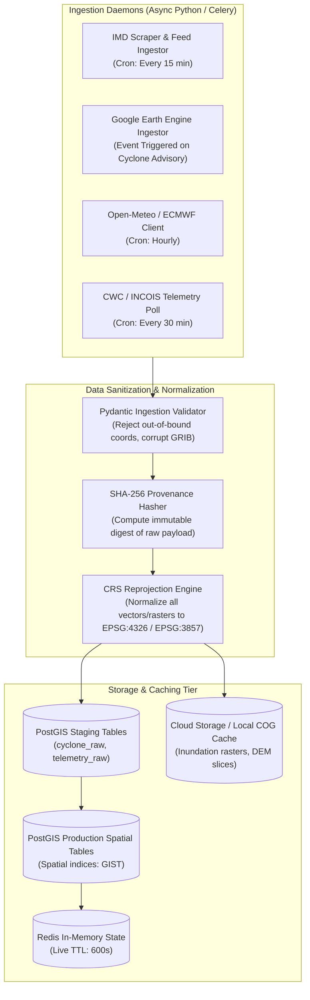

# PRALAYA: Data Sources, Ingestion Pipelines & Provenance Catalog

---

### 1. External Data Sources Master Registry

PRALAYA integrates heterogeneous earth observation, meteorological, topological, infrastructure, and demographic data streams into a unified geospatial decision surface.

| Category | Source Name | Provider / Authority | Access Protocol & Format | Spatial / Temporal Resolution | Authority Level | Primary Use in PRALAYA |
| :--- | :--- | :--- | :--- | :--- | :--- | :--- |
| **Meteorology** | **IMD Cyclone Bulletins** | India Meteorological Department (RSMC) | HTTP Polling (XML/JSON/PDF) | Station points / 3-hourly update | **Level 1 (Highest)** | Official cyclone eye coordinates, central pressure $P_c$, radius of max winds $R_{\text{max}}$, landfall ETA. |
| **Meteorology** | **ECMWF Open Data** | European Centre for Medium-Range Weather | REST / GRIB2 & NetCDF | $0.4^\circ$ spatial grid / 6-hourly cycle | Level 2 (High) | Far-field wind fields, atmospheric pressure gradients, track ensemble spread. |
| **Meteorology** | **NOAA GFS** | US National Weather Service | AWS Open Data / GRIB2 | $0.25^\circ$ grid / 6-hourly cycle | Level 2 (High) | Cross-validation of cyclone intensity and deep-layer steering wind vectors. |
| **Meteorology** | **Open-Meteo API** | Open-Meteo | JSON REST API | Point-level / Hourly updates | Level 3 (Operational) | Fast hourly pluvial precipitation accumulation, surface gusts, localized barometric pressure. |
| **Satellite SAR** | **Sentinel-1 SAR GRD** | European Space Agency (ESA) / Copernicus | Google Earth Engine Python API | 10m spatial resolution / 6-12 day revisit | **Level 1 (Direct EO)** | All-weather, cloud-penetrating synthetic aperture radar flood inundation delineation (Otsu bimodal). |
| **Satellite Optical**| **Sentinel-2 MSI** | European Space Agency (ESA) / Copernicus | Google Earth Engine Python API | 10m bands (B3, B8, B11) / 5-day revisit | Level 2 (High) | Normalized Difference Water Index (NDWI) for baseline waterbody masking and post-storm sediment tracking. |
| **Elevation / DEM** | **FABDEM v1-2** | University of Bristol | Cloud-Optimized GeoTIFF (COG) | 30m spatial resolution / Static | **Level 1 (Standard)** | Bare-earth digital elevation model with forest and building heights removed; critical for plinth inundation. |
| **Elevation / DEM** | **Copernicus GLO-30** | ESA / Airbus | Cloud-Optimized GeoTIFF (COG) | 30m spatial resolution / Static | Level 2 (High) | Regional coastal elevation baseline and slope analysis. |
| **Infrastructure** | **OpenStreetMap (OSM)** | OpenStreetMap Foundation / Overpass | Overpass API / Geofabrik PBF | Vector lines and polygons / Daily sync | Level 2 (High) | Navigable road network graph, bridges, culverts, hospital points, police and fire stations. |
| **Infrastructure** | **Overture Maps** | Overture Maps Foundation | Cloud Parquet / GeoParquet | Global vector features / Monthly release | Level 2 (High) | Building footprint polygons, validated structural outlines, road hierarchy tags. |
| **Demographics** | **WorldPop 100m** | WorldPop / University of Southampton | GeoTIFF Raster | $100 \times 100\text{ m}$ grid / 2024 projection | Level 2 (High) | High-resolution residential population density and age-bracket breakdown (infants, elderly). |
| **Demographics** | **Census / SECC Data**| Government of India (Census/SECC) | Structured Tabular / PostgreSQL | Village / Ward level / Decennial + SECC | **Level 1 (Official)** | Building construction types (kutcha, semi-pucca, pucca), household poverty indices, vehicle ownership. |
| **In-Situ Sensors** | **CWC River Gauges** | Central Water Commission | JSON REST API / Web Scraper | Station points / Hourly telemetry | **Level 1 (Official)** | River stage heights, discharge volumes ($m^3/s$), warning level and danger level threshold breaches. |
| **In-Situ Sensors** | **INCOIS Buoys** | Indian National Centre for Ocean Info | INCOIS Data Portal / JSON | Ocean buoy moorings / Hourly telemetry | **Level 1 (Official)** | Significant wave height ($H_s$), sea surface temperature (SST), coastal tide gauge levels. |

---

### 2. Ingestion Pipelines & Data Lifecycle



---

### 3. Google Earth Engine (GEE) Ingestion Specifications

The GEE processing pipeline extracts surface water inundation masks from SAR observations during cloud-covered cyclone conditions:

#### GEE Python Pipeline Definition:
```python
# Conceptual GEE SAR Inundation Ingestion Routine
import ee

def ingest_sentinel1_flood_extent(bbox: list[float], date_start: str, date_end: str) -> dict:
    """
    Ingests Sentinel-1 GRD SAR imagery over coastal AOI and evaluates flood mask.
    bbox: [min_lon, min_lat, max_lon, max_lat]
    """
    geometry = ee.Geometry.BBox(*bbox)
    
    # Filter Level-1 GRD IW mode with VV polarization
    s1_collection = (
        ee.ImageCollection("COPERNICUS/S1_GRD")
        .filterBounds(geometry)
        .filterDate(date_start, date_end)
        .filter(ee.Filter.listContains("transmitterReceiverPolarisation", "VV"))
        .filter(ee.Filter.eq("instrumentMode", "IW"))
    )
    
    # 1. Mosaic and apply Lee Speckle filtering
    event_image = s1_collection.select("VV").mosaic().clip(geometry)
    
    # 2. Historical baseline image (dry season composite)
    baseline_image = (
        ee.ImageCollection("COPERNICUS/S1_GRD")
        .filterBounds(geometry)
        .filterDate("2025-01-01", "2025-03-31")
        .select("VV")
        .median()
        .clip(geometry)
    )
    
    # 3. Difference backscatter and Otsu thresholding (< -16dB and difference < -3dB)
    diff = event_image.subtract(baseline_image)
    flood_mask = event_image.lt(-16.0).And(diff.lt(-3.0))
    
    # 4. Mask permanent waterbodies using Sentinel-2 Land Cover
    permanent_water = ee.Image("COPERNICUS/Landcover/100m/Proba-V-C3/Global/2019").select("discrete_classification").eq(80)
    inundation_only = flood_mask.And(permanent_water.Not())
    
    # Export as lightweight GeoJSON vector polygons
    flood_polygons = inundation_only.reduceToVectors(
        geometry=geometry,
        scale=30,
        geometryType="polygon",
        eightConnected=False,
        maxPixels=1e8
    )
    return flood_polygons.getInfo()
```

---

### 4. Data Provenance & Verification Metadata Envelope

Every data item stored in PostgreSQL or returned via the REST API is wrapped in a strict provenance metadata block:

```json
{
  "source_metadata": {
    "source_id": "IMD_RSMC_BULLETIN_CYCLONE_KARUNA_08",
    "source_authority": "India Meteorological Department, New Delhi",
    "verification_level": "OFFICIAL_GOVERNMENT_FEED",
    "authority_rank": 1,
    "ingested_at": "2026-09-27T08:32:15.102Z",
    "observation_time": "2026-09-27T08:00:00.000Z",
    "raw_payload_sha256": "4f53cda18c2d27719c3b4e18b8504f762a5b6c91d8e12480bf139b4b09e2a875",
    "confidence_score": 0.98,
    "is_synthetic_simulation": false
  }
}
```

#### Authority Rank Hierarchy:
1. **Rank 1 (`OFFICIAL_GOVERNMENT_FEED`)**: IMD, NDMA, CWC, INCOIS, ESA/Copernicus Sentinel data. Overrides all other feeds.
2. **Rank 2 (`SCIENTIFIC_SURROGATE_MODEL`)**: ECMWF, NOAA GFS, WorldPop, FABDEM. High scientific validity; used for forecasting and physical models.
3. **Rank 3 (`OPEN_COMMUNITY_BASEMAP`)**: OpenStreetMap, Overture Maps. Validated spatial infrastructure networks.
4. **Rank 4 (`COMMUNITY_CROWDSOURCED`)**: Social media crisis reports, citizen app telemetry. Must be explicitly flagged as `UNVERIFIED_CROWD_DATA` until corroborated by at least 3 independent nodes or an official sensor.

---

### 5. Offline Pre-Seeded Datasets & Air-Gapped Scenario Fixture

To guarantee $100\%$ uptime during hackathon presentations and air-gapped disaster command room deployments, PRALAYA includes the **"Cyclone Karuna" Pre-Seeded Reference Fixture**:

- **Location**: Coastal Odisha & Northern Andhra Pradesh (Puri, Ganjam, Srikakulam districts).
- **Temporal Horizon**: 72 hours spanning $T-48\text{h}$ (Offshore depression) to $T+24\text{h}$ (Post-landfall dissipating depression).
- **Pre-Packaged Local Files**:
  - `cyclone_karuna_track.json`: 12 temporal advisory vectors with eye coordinates, pressure, wind velocity, and cone of uncertainty.
  - `odisha_coastal_roads.pbf` & `.json`: Pre-processed NetworkX road graph containing 18,450 nodes and 32,800 edges with bridge clearances and plinth heights.
  - `odisha_shelters_verified.json`: 240 certified cyclone shelters with verified capacities, plinth elevations ($Z_{\text{plinth}}$), medical stockpiles, and solar backup status.
  - `critical_infrastructure_odisha.json`: 85 assets (12 hospitals, 18 power substations, 24 mobile towers, 15 water treatment facilities, 16 coastal bridges) with topological dependency links.
  - `inundation_rasters_t0_to_t48/`: Pre-computed Cloud-Optimized GeoTIFFs (30m resolution) for each 6-hour forecast interval.

If any external API (IMD, GEE, Open-Meteo, Gemini) is unreachable or network connectivity is severed, the system instantly engages `OFFLINE_FIXTURE_MODE` without throwing unhandled exceptions or disrupting user experience.
