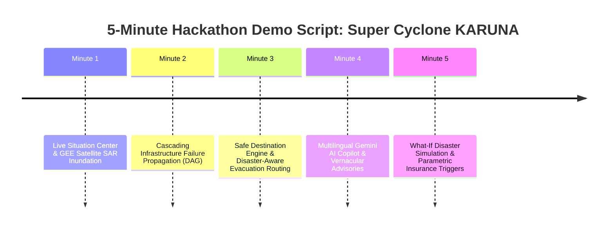

# PRALAYA: Hackathon Live Demonstration Playbook (Cyclone "KARUNA / VAJRA")

---

### 1. Scenario Context: Super Cyclone "KARUNA / VAJRA" (Bay of Bengal)

- **Target Geography**: Coastal Odisha & Northern Andhra Pradesh (Puri, Paradip, Ganjam, Srikakulam corridor).
- **Meteorological Profile**:
  - Central Pressure: $938\text{ hPa}$
  - Max Sustained Winds: $195\text{ km/h}$ (Equivalent to Category 4 / Very Severe Cyclonic Storm)
  - Astronomical High Tide: $+1.4\text{ m}$
  - Peak Predicted Storm Surge: $+4.2\text{ m}$
  - Landfall ETA: $T - 4\text{ hours}$
- **Core Narrative**: Demonstrate how PRALAYA transforms an impending disaster from chaotic reactive scramble into structured anticipatory resilience.

---

### 2. Minute-by-Minute Live Pitch Choreography (5-Minute Demonstration)

---

#### Minute 1 (0:00 - 1:00): The Live Situation Center & Satellite Inundation
- **Visual State**: Dark mission-control interface loads instantly. MapLibre GL shows the live cyclone track, cone of uncertainty, wind velocity vectors, and high-contrast flood contours.
- **Presenter Action**:
  1. Point to the top metric ribbon: `142,500 Population in Surge Zone`, `32 Critical Assets Exposed`, `IMD Bulletin #14 (Verified Provenance)`.
  2. Toggle the **"Sentinel-1 SAR Radar Inundation Layer"**. Show the deep-blue actual water extent overlapping the orange predicted storm surge envelope.
- **Presenter Script**:
  > *"Judges, this is PRALAYA. We are looking at Super Cyclone KARUNA, 4 hours before landfall on the Odisha coast. Instead of generic warnings, PRALAYA ingests satellite SAR radar, high-resolution elevation models, and official IMD feeds to compute exact hydrodynamic inundation down to street level in under 600 milliseconds."*

---

#### Minute 2 (1:00 - 2:00): Infrastructure Failure Cascades
- **Visual State**: Switch to the **Cascade Failure Graph View**.
- **Presenter Action**:
  1. Click on **Substation Chhatrapur-01**. The map highlights the facility turning from green to flashing red (Current flood depth: $0.65\text{ m} > 0.40\text{ m}$ tolerance).
  2. The failure propagation animation visually traces downstream links:
     - Edge 1: District Hospital grid power cuts.
     - Edge 2: North Water Pumping Station shuts down.
  3. The Hospital card displays: `Backup Generator Active: 7h 45m remaining. ICU Evacuation Window: T-3 hours.`
- **Presenter Script**:
  > *"Disasters don't happen in silos—they cascade. Here, when the Chhatrapur electrical substation floods at 0.65 meters, our deterministic DAG instantly computes the secondary and tertiary impacts: the district hospital loses primary power and the northern drinking water pumps fail. Incident commanders know hours in advance that ICU patients must be transferred before generators run dry."*

---

#### Minute 3 (2:00 - 3:00): Safe Havens & Hazard-Aware Routing
- **Visual State**: Shift viewport to a vulnerable coastal village.
- **Presenter Action**:
  1. Click **"Calculate Evacuation Corridor"** for 250 residents.
  2. The system evaluates regional shelters using TOPSIS multi-criteria ranking.
  3. The closest shelter is **rejected** because its access road is inundated by $0.7\text{ m}$ of water.
  4. The system selects **Kalyanpur High School Cyclone Shelter** (12.4m elevation, 790 open spots) and draws an active 3D glowing green route.
  5. Toggle "Show Standard Route vs. PRALAYA Route": standard shortest path would have led evacuees directly into the flooded river bridge; PRALAYA routes safely around the inland highland ridge.
- **Presenter Script**:
  > *"Standard routing apps optimize for distance or traffic—leading fleeing buses into submerged bridges. PRALAYA's Disaster-Aware Routing engine penalizes floodwater exponentially. It rejects the closest shelter because the access road is underwater, choosing a safe, elevated haven and navigating entirely through dry corridors."*

---

#### Minute 4 (3:00 - 4:00): Gemini AI Copilot & Vernacular Localization
- **Visual State**: Open the **Gemini AI Copilot Panel** on the right sidebar.
- **Presenter Action**:
  1. Voice/Type query: *"Explain the immediate hazard to the local Sarpanch and generate an emergency alert in Odia."*
  2. Watch Gemini stream the response:
     - Explains the failure cascade simply.
     - Invokes tool `get_safe_shelter_destinations`.
     - Displays formatted advisory in **Odia script** with English subtitles and audio-ready broadcast format.
  3. Point out the verification badge: `[VERIFIED PRALAYA CORE | HASH: e4b2... | ZERO HALLUCINATIONS]`.
- **Presenter Script**:
  > *"Gemini acts as our multilingual reasoning layer. Crucially, Gemini does NOT invent shelters or flood numbers—it calls our deterministic backend tools. It translates complex hydrodynamic telemetry into panic-free, culturally tailored advisories in Odia, Bengali, Telugu, or Hindi, ready for SMS or loudspeaker broadcasts."*

---

#### Minute 5 (4:00 - 5:00): What-If Simulation & Parametric Payouts
- **Visual State**: Switch to the **What-If Disaster Sandbox** & **Parametric Insurance Tab**.
- **Presenter Action**:
  1. Grab the **"Storm Surge Shock Slider"** and increase sea level by $+1.5\text{ meters}$ (simulating high-tide landfall sync).
  2. The map recalculates in real-time: the blue flood envelope expands, 3 additional shelters turn red, and exposed population rises by $+38,000$.
  3. Switch to the **Parametric Insurance Trigger**: show that wind speed ($>160\text{ km/h}$) and surge ($>4.0\text{ m}$) have deterministically satisfied the smart-contract conditions for local fisherfolk families.
  4. Display status: `Automated Liquidity Disbursal Triggered: ₹15,000 / family`.
- **Presenter Script**:
  > *"Finally, PRALAYA empowers leadership to play forward scenarios: what if the surge is 1.5 meters higher? In seconds, commanders see which fallback shelters to activate. And for recovery, our parametric insurance engine validates physical thresholds instantly, unlocking automated relief payouts to coastal fisherfolk before floodwaters even recede."*

---

### 3. Fail-Proof Deterministic Hackathon Demo Seed Bundle

All demo assets are located in `backend/data/` and `data/seed/`:
- `cyclone_karuna.json`: 72-hour realistic IMD bulletin sequence.
- `shelters_odisha.json`: Geocoded shelters with real elevation & capacities.
- `assets_odisha.json`: Geocoded hospitals, power substations, and water plants with dependency DAG links.
- `road_graph_odisha.json`: Pre-built topological road network.
