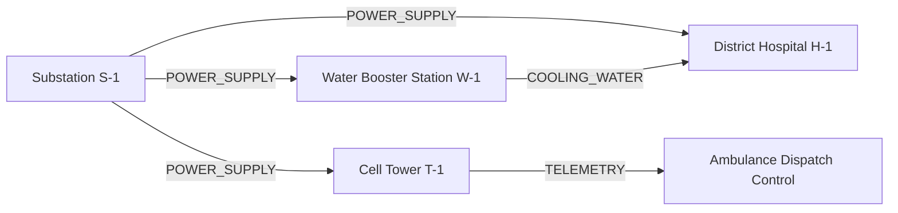

# PRALAYA: Mathematical Risk Models & Deterministic Algorithms

---

### 1. Hazard Calculation Engine

The Hazard Engine computes the spatial footprint of storm surge inundation, wind decay, and inland pluvial accumulation without stochastic LLM approximation.

#### 1.1 Storm Surge Hydrodynamic Surrogate Formulation
The total coastal water level $H_{\text{total}}(x, y, t)$ is modeled as the linear superposition of astronomical tide, inverse barometer effect, and wind-stress setup:
$$H_{\text{total}}(x, y, t) = \eta_{\text{tide}}(t) + \Delta \eta_{\text{baro}}(x, y) + \Delta \eta_{\text{wind}}(x, y)$$

1. **Inverse Barometer Effect ($\Delta \eta_{\text{baro}}$)**:
   $$\Delta \eta_{\text{baro}} = \frac{P_n - P_c}{\rho_w \cdot g}$$
   Where:
   - $P_n = 1013.25\text{ hPa}$ (ambient far-field atmospheric pressure)
   - $P_c$ = central cyclone core pressure ($\text{hPa}$)
   - $\rho_w = 1025\text{ kg/m}^3$ (seawater density)
   - $g = 9.80665\text{ m/s}^2$ (gravitational acceleration)
   - Rule of thumb: $\approx 1.0\text{ cm}$ surge per $1\text{ hPa}$ pressure drop.

2. **Wind-Driven Surge Setup ($\Delta \eta_{\text{wind}}$)**:
   Derived from the 1D shallow water wind-stress equilibrium along the bathymetric shelf:
   $$\Delta \eta_{\text{wind}} = \int_0^L \frac{\tau_w}{\rho_w \cdot g \cdot (h(x) + \eta)} \, dx \approx \frac{C_d \cdot \rho_a \cdot V_{\text{max}}^2 \cdot L}{g \cdot \bar{h}}$$
   Where:
   - $V_{\text{max}}$ = maximum sustained surface wind speed ($\text{m/s}$)
   - $C_d = (0.8 + 0.065 \cdot V_{\text{max}}) \times 10^{-3}$ (Wu aerodynamic drag coefficient)
   - $\rho_a = 1.225\text{ kg/m}^3$ (surface air density)
   - $L$ = continental shelf width ($\text{m}$)
   - $\bar{h}$ = mean shelf depth ($\text{m}$)

3. **Holland Wind Field Model (Radial Profile)**:
   For radial distance $r$ from cyclone eye:
   $$V(r) = \left[ \frac{B}{\rho_a} \left(\frac{R_{\text{max}}}{r}\right)^B (P_n - P_c) \exp\left(-\left(\frac{R_{\text{max}}}{r}\right)^B\right) + \left(\frac{r \cdot f}{2}\right)^2 \right]^{1/2} - \frac{r \cdot f}{2}$$
   Where:
   - $R_{\text{max}}$ = radius of maximum winds ($\text{km}$)
   - $B$ = Holland peakedness shape parameter ($1.0 \le B \le 2.5$)
   - $f = 2\Omega \sin(\phi)$ is the Coriolis parameter ($\Omega = 7.2921 \times 10^{-5}\text{ rad/s}$)

#### 1.2 Inundation Depth over Terrain
At any land coordinate $(x, y)$ with elevation $Z_{\text{FABDEM}}(x, y)$:
$$D_{\text{flood}}(x, y) = \max\left(0, H_{\text{total}}(x, y) - Z_{\text{FABDEM}}(x, y) - \mu_{\text{roughness}} \cdot d_{\text{coast}}\right)$$
Where $d_{\text{coast}}$ is distance from shoreline and $\mu_{\text{roughness}}$ is surface friction dissipation ($\approx 0.0005\text{ m/m}$).

---

### 2. Exposure & Vulnerability Formulations

#### 2.1 Spatial Exposure Index ($E$)
For a given demographic unit or grid cell $k$:
$$E_k = \sum_{i=1}^{N_{\text{pop}}} w_i \cdot \mathbb{I}\left(P_i \in \text{Zone}_k\right) + \sum_{j=1}^{M_{\text{asset}}} C_j \cdot \mathbb{I}\left(A_j \in \text{Zone}_k\right)$$
Where:
- $w_i$ is demographic vulnerability weight: infants ($1.5$), elderly $> 65$ ($1.5$), differently-abled ($2.0$), able-bodied adults ($1.0$).
- $C_j$ is asset criticality weight: Class 4: ICU Hospitals ($100$); Class 3: Main Substations ($80$); Class 2: Evacuation Bridges ($50$); Class 1: Minor Roads ($10$).

#### 2.2 Socioeconomic & Physical Vulnerability Index ($V$)
Vulnerability combines physical housing fragility $F_{\text{struct}}$ and Social Vulnerability Index ($\text{SoVI}$):
$$V_k = \alpha \cdot F_{\text{struct}}(k) + (1 - \alpha) \cdot \text{SoVI}(k) \quad (\alpha = 0.55)$$
Where:
- $F_{\text{struct}} = \frac{N_{\text{kutcha}} \cdot 1.0 + N_{\text{semi-pucca}} \cdot 0.6 + N_{\text{pucca}} \cdot 0.15}{N_{\text{total\_houses}}}$
- $\text{SoVI}$ is computed as the normalized sum of normalized socioeconomic deprivation indicators:
  $$\text{SoVI}_k = \frac{1}{M} \sum_{m=1}^{M} \frac{X_{k, m} - \min(X_m)}{\max(X_m) - \min(X_m)}$$
  (Indicators: poverty ratio, female illiteracy, zero-vehicle ownership, single-parent households).

#### 2.3 Total Anticipatory Disaster Risk ($R$)
$$\text{Risk}_k = \left(D_{\text{flood}}(k) \cdot \frac{V_{\text{wind}}(k)}{V_{\text{threshold}}}\right) \times E_k \times V_k$$

---

### 3. Infrastructure Failure Cascade Engine (NetworkX DAG)

The inter-infrastructure network is modeled as a Directed Acyclic Graph $\mathcal{G} = (\mathcal{V}, \mathcal{E})$:
- $\mathcal{V}$: Infrastructure nodes (Power substations, Water booster stations, Hospitals, Cell towers).
- $\mathcal{E}$: Directed dependency edges $(u, v)$ where asset $v$ relies on continuous service from asset $u$.

#### Deterministic Cascade Propagation Algorithm:
1. **Initial Trigger**:
   For each node $v \in \mathcal{V}$, if $D_{\text{flood}}(v) \ge \theta_{\text{flood}}(v)$, set $\text{Status}(v) = \text{FAILED}$.
2. **Recursive Downstream Traversal**:
   For each child node $w \in \text{Children}(v)$:
   - **Case 1: Edge Type = `POWER_SUPPLY`**:
     - Check backup power:
       $$\text{Runtime}_{\text{remaining}}(w) = \text{Capacity}_{\text{fuel}}(w) - \kappa \cdot t_{\text{elapsed}}$$
     - If $\text{Runtime}_{\text{remaining}}(w) \le 0$:
       Set $\text{Status}(w) = \text{FAILED}$.
     - Else:
       Set $\text{Status}(w) = \text{DEGRADED}$ (Operating on diesel generator).
   - **Case 2: Edge Type = `COOLING_WATER`**:
     - If $w$ is an MRI/HVAC unit in Hospital and Water Booster fails, trigger shutdown within $1.5\text{ hours}$.
   - **Case 3: Edge Type = `ACCESS_ROAD`**:
     - If road edge flood depth $> 0.3\text{ m}$, flag asset as `ISOLATED_LOGISTICALLY`.
3. **Escalation Triggers**:
   If $\text{Status}(\text{Hospital}) == \text{FAILED}$ and $\text{ICU\_Count} > 0$, automatically trigger priority evacuation dispatch.

---

### 4. Safe Destination Scoring Algorithm (TOPSIS Method)

Shelters are ranked deterministically using the **Technique for Order Preference by Similarity to Ideal Solution (TOPSIS)**.

#### Evaluation Criteria ($C$):
1. **$C_1$: Inundation Clearance Margin ($w_1 = 0.35$)**:
   $$M_{\text{clearance}} = Z_{\text{plinth}} - H_{\text{surge\_predicted}} \quad (\text{Constraint: } M_{\text{clearance}} \ge 0.5\text{ m})$$
2. **$C_2$: Available Free Capacity Ratio ($w_2 = 0.25$)**:
   $$Cap_{\text{ratio}} = \frac{\text{Certified\_Capacity} - \text{Current\_Occupancy}}{\text{Certified\_Capacity}}$$
3. **$C_3$: Access Road Viability Score ($w_3 = 0.25$)**:
   $$R_{\text{access}} = \exp\left(-\lambda \cdot \max_{e \in \text{Route}} D_{\text{flood}}(e)\right)$$
4. **$C_4$: Critical Facility Readiness ($w_4 = 0.15$)**:
   $$F_{\text{ready}} = 0.4 \cdot \mathbb{I}_{\text{gen}} + 0.3 \cdot \mathbb{I}_{\text{potable}} + 0.3 \cdot \mathbb{I}_{\text{medic}}$$

#### Mathematical Steps:
1. **Vector Normalization**:
   $$r_{ij} = \frac{x_{ij}}{\sqrt{\sum_{k=1}^m x_{kj}^2}}$$
2. **Weighted Normalized Matrix**:
   $$v_{ij} = w_j \cdot r_{ij}$$
3. **Determine Ideal Best ($A^+$) and Ideal Worst ($A^-$)**:
   $$A^+ = \{\max_i v_{i1}, \dots, \max_i v_{in}\}, \quad A^- = \{\min_i v_{i1}, \dots, \min_i v_{in}\}$$
4. **Euclidean Separation Distances**:
   $$S_i^+ = \sqrt{\sum_{j=1}^n (v_{ij} - A_j^+)^2}, \quad S_i^- = \sqrt{\sum_{j=1}^n (v_{ij} - A_j^-)^2}$$
5. **Relative Closeness Score**:
   $$C_i = \frac{S_i^-}{S_i^+ + S_i^-} \quad (0 \le C_i \le 1)$$
   Shelters are ranked in descending order of $C_i$.

---

### 5. Disaster-Aware Evacuation Routing Algorithm

Standard shortest-path algorithms fail during cyclones because they route evacuees through low-lying coastal arterial highways that submerge rapidly.

#### Dynamic Cost Function Formulation:
For each road edge $e = (u, v)$ in the OpenStreetMap network graph:
$$\text{Cost}(e) = \text{Length}(e) \cdot \Phi\left(D_{\text{flood}}(e)\right) \cdot \Psi\left(\text{ElevationSlope}(e)\right)$$

Where the flood penalty function $\Phi$ is strictly non-linear:
$$\Phi\left(D_{\text{flood}}\right) = 
\begin{cases} 
1.0 & \text{if } D_{\text{flood}} \le 0.05\text{ m} \\
1.0 + \alpha \cdot \exp\left(\beta \cdot D_{\text{flood}}\right) & \text{if } 0.05 < D_{\text{flood}} \le 0.30\text{ m} \\
+\infty & \text{if } D_{\text{flood}} > 0.30\text{ m} \quad (\text{Vehicle Stall / Impassable})
\end{cases}$$
$(\alpha = 2.5, \beta = 8.0)$.

#### Solver:
- Implemented as a **Bidirectional $A^*$ Search** with a modified admissible heuristic incorporating elevation gains:
  $$h(n) = \text{HaversineDistance}(n, \text{Target}) + \mu \cdot \max\left(0, Z_{\text{target}} - Z_n\right)$$
- If the solver returns no feasible path (all routes submerged $> 0.3\text{ m}$), the system returns:
  `STATUS = NO_SAFE_GROUND_ROUTE` and dispatches an automated alert requesting aerial or amphibious NDRF rescue boats.

---

### 6. Emergency Resource Optimization (MILP Formulation)

Allocating rescue assets (NDRF battalions, rescue inflatable boats, mobile generators) to vulnerable zones is formulated as a Mixed-Integer Linear Program (MILP):

#### Variables:
- $x_{ij} \in \mathbb{Z}^+$: Quantity of resource type $k$ dispatched from depot $i$ to high-risk zone $j$.
- $u_j \in \mathbb{R}^+$: Unmet population risk in zone $j$.

#### Objective Function:
$$\min \sum_{j \in \text{Zones}} u_j \cdot \text{Risk}_j + \gamma \sum_{i \in \text{Depots}} \sum_{j \in \text{Zones}} t_{ij} \cdot x_{ij}$$
Where $t_{ij}$ is the travel transit time along viable unflooded corridors.

#### Constraints:
1. **Supply Capacity**: $\sum_{j} x_{ij} \le \text{Stock}_{ik} \quad \forall i, k$
2. **Demand Coverage**: $u_j \ge \text{ExposedPop}_j - \sum_i \text{Capacity}_k \cdot x_{ij} \quad \forall j$
3. **Transit Time Window**: $x_{ij} \cdot t_{ij} \le T_{\text{cutoff}} \quad (\text{Must arrive prior to storm surge onset})$
