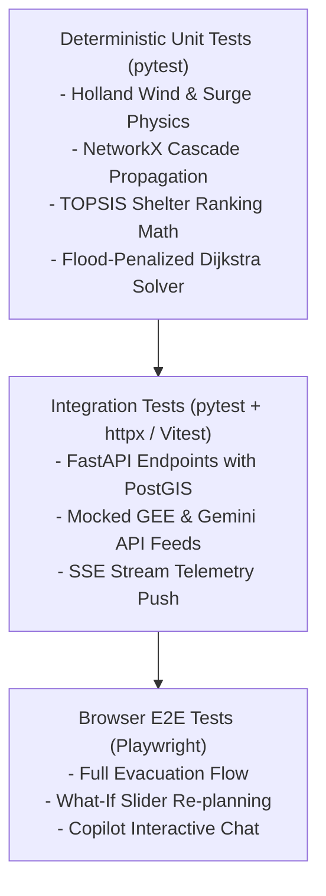

# PRALAYA: Comprehensive Test Strategy & QA Framework

---

### 1. Testing Pyramid & Quality Objectives

PRALAYA employs a multi-tiered testing harness designed to validate deterministic mathematical accuracy, prevent LLM hallucinations, guarantee sub-second API latencies, and verify mission-critical browser UI flows.



---

### 2. Deterministic Mathematical Unit Tests

Unit tests validate physical formulas against known analytical benchmark values without mocking or approximations.

#### 2.1 Holland Wind & Surge Hydrodynamics (`test_holland_surge.py`)
```python
import pytest
from app.services.hazard_engine import compute_holland_wind_speed, compute_inverse_barometer_surge

def test_inverse_barometer_surge():
    # 1 hPa pressure drop corresponds to ~0.00993 m (~1 cm) sea surface rise
    p_ambient = 1013.25
    p_central = 952.00  # Delta = 61.25 hPa
    surge = compute_inverse_barometer_surge(p_ambient, p_central)
    assert pytest.approx(surge, 0.05) == 0.608  # ~0.61 meters

def test_holland_wind_radial_decay():
    # Wind speed must peak exactly at R_max and decay monotonically outwards
    r_max = 35.0  # km
    p_central = 950.0
    b_param = 1.45
    
    v_rmax = compute_holland_wind_speed(r=35.0, r_max=r_max, pc=p_central, b=b_param)
    v_outer = compute_holland_wind_speed(r=100.0, r_max=r_max, pc=p_central, b=b_param)
    
    assert v_rmax > v_outer
    assert v_rmax > 45.0  # Must exceed hurricane threshold (m/s)
```

#### 2.2 Disaster-Aware Evacuation Routing (`test_flood_routing.py`)
```python
import networkx as nx
from app.services.routing_engine import FloodAwareRouter

def test_routing_rejects_submerged_edges():
    # Construct a simple triangular graph: A -> B (Highway, flooded) vs A -> C -> B (Ridge road, dry)
    router = FloodAwareRouter()
    G = nx.Graph()
    G.add_edge("A", "B", length=5.0, flood_depth=0.75)   # Submerged highway (> 0.30m)
    G.add_edge("A", "C", length=4.0, flood_depth=0.00)   # Dry ridge road
    G.add_edge("C", "B", length=4.0, flood_depth=0.02)   # Minor puddle (< 0.05m)
    
    path, max_depth = router.find_safest_path(G, origin="A", target="B")
    
    # Assert highway was rejected despite being shorter (5km vs 8km)
    assert path == ["A", "C", "B"]
    assert max_depth <= 0.05
```

---

### 3. Gemini Copilot Guardrail & Anti-Hallucination Tests

Tests in this suite deliberately attempt to trick the Gemini Copilot into hallucinating fake shelters or fabricated statistics.

```python
# tests/backend/integration/test_copilot_guardrails.py
import pytest
from app.copilot.guardrails import HallucinationGuardrail

@pytest.mark.asyncio
async def test_guardrail_intercepts_unverified_shelter():
    guardrail = HallucinationGuardrail(db_session=None)
    context = {"valid_shelter_ids": {"SHELTER_KALYANPUR_HS", "SHELTER_CHATRAPUR_COLL"}}
    
    # Hallucinated string generated by rogue LLM
    hallucinated_text = "Please proceed to SHELTER_ATLANTIS_99 which has 500 open beds."
    
    is_valid, sanitized_text = await guardrail.verify_generated_text(hallucinated_text, context)
    
    assert is_valid is False
    assert "SHELTER_ATLANTIS_99 not found" in sanitized_text
```

---

### 4. End-to-End Browser UI Tests (Playwright)

Automated browser suites simulate the exact workflow of an Incident Commander during live storm landfall.

```typescript
// tests/frontend/e2e/test_evacuation_flow.spec.ts
import { test, expect } from '@playwright/test';

test.describe('PRALAYA Mission Control E2E Flow', () => {
  test('Complete situation awareness, what-if re-planning, and safe routing', async ({ page }) => {
    // 1. Navigate to Mission Control
    await page.goto('http://localhost:5173');
    await expect(page.locator('h1')).toContainText('PRALAYA');
    
    // 2. Verify active storm metrics card
    const stormCard = page.locator('#kpi-storm-category');
    await expect(stormCard).toContainText('Extremely Severe Cyclonic Storm');
    
    // 3. Open Safe Route Navigator
    await page.click('#btn-plan-evacuation');
    await page.click('#select-origin-cluster-chhatrapur');
    
    // 4. Verify calculated path avoids flooded coastal highway
    const routeSummary = page.locator('#route-summary-panel');
    await expect(routeSummary).toContainText('Safe Route Computed');
    await expect(routeSummary).toContainText('Ridge Road');
    await expect(routeSummary).not.toContainText('State Highway 14');
    
    // 5. Test What-If Slider Re-planning
    const surgeSlider = page.locator('#slider-surge-override');
    await surgeSlider.fill('2.0'); // +2.0m surge override
    await page.click('#btn-run-simulation');
    
    // 6. Verify automated route recalculation and cascade alert banner
    await expect(page.locator('#alert-cascade-warning')).toBeVisible();
    await expect(page.locator('#alert-cascade-warning')).toContainText('Substation S-1 Compromised');
    
    // 7. Verify Gemini Copilot stream
    await page.fill('#copilot-chat-input', 'Why was State Highway 14 avoided?');
    await page.click('#btn-send-copilot');
    
    const copilotResponse = page.locator('.copilot-message-assistant').last();
    await expect(copilotResponse).toContainText('0.74m water accumulation', { timeout: 8000 });
  });
});
```

---

### 5. Automated CI/CD Test Matrix & Quality Gates

| Test Phase | Tooling | Execution Trigger | Gate Threshold |
| :--- | :--- | :--- | :--- |
| **Lint & Format** | Ruff, ESLint, Prettier | Every Commit / PR | Zero errors, zero warnings. |
| **Type Checking** | Mypy (`--strict`), `tsc --noEmit` | Every Commit / PR | 100% type coverage, zero `any`. |
| **Backend Unit** | pytest, pytest-cov | Pull Request | $\ge 90\%$ statement coverage on risk math. |
| **API Integration** | pytest-asyncio, HTTPX | Pull Request | 100% endpoints return valid RFC 7807 on failure. |
| **E2E Browser** | Playwright (Chromium, Firefox) | Merge to Main / Nightly | 100% pass on evacuation flow. |
